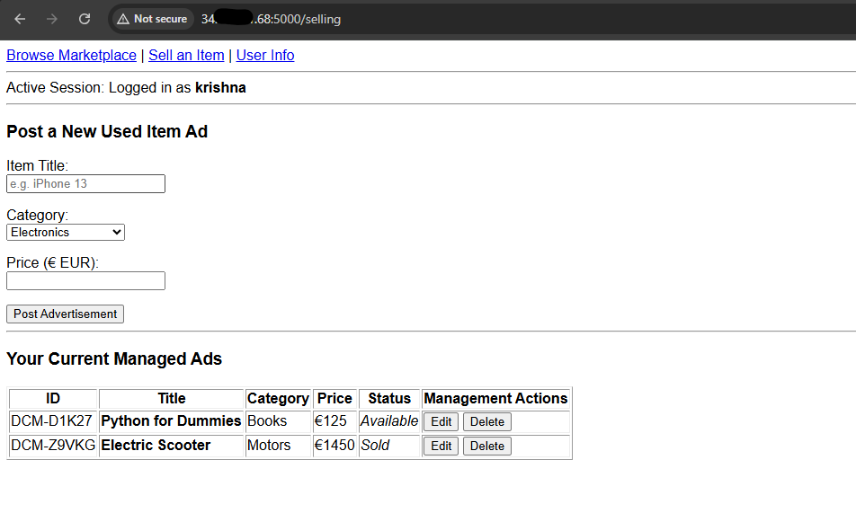
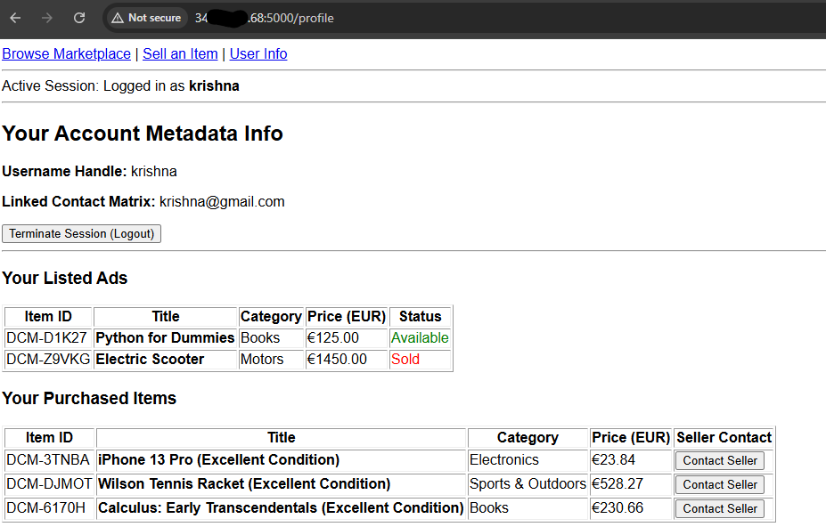

# 20100882-project
 PROGRAMMING FOR INFORMATION SYSTEMS Semester Repository

This Project is about a Dublin Classified Market place application. This allow users to browse listing , post ads and manage the items listed.

# Dublin Classifieds Marketplace

A localized, classifieds application using a  Python stack. This full-stack system allows users to securely register accounts, sign in securely, post structured listings, edit asset data entries, and purchase goods using an asynchronous single-page checkout configuration.

---

### Core Technologies & Software

The core infrastructure operates on Single-Page-Application model with a relational backend data layer:

* **Programming Languages:** * **Python 3.12+** (Backend logic and routing)
  * **JavaScript** (Dynamic UI updates, sorting, and asynchronous API communication)
  * **HTML5** (Layout presentation and structure)
* **Frameworks & Core Libraries:**
  * **Flask** - Lightweight micro-framework for serving pages and API endpoints.
  * **Flask-Cors** - Handles Cross-Origin Resource Sharing for API security.
  * **Werkzeug** - Handles secure, salted password hashing algorithm.
* **Database Engine:**
  * **SQLite3** - Serverless, self-contained relational database utilizing local file storage (`classifieds.db`).

---

## 🗄️ Relational Database Schema

The SQLite database structure enforces relational integrity using foreign keys with cascading nulls on delete.

### 1. `users` Table
Stores authenticated member accounts and contact metrics.

| Column | Data Type | Constraints | Description |
| :--- | :--- | :--- | :--- |
| `id` | INTEGER | PRIMARY KEY AUTOINCREMENT | Unique system identifier for each user. |
| `username` | TEXT | NOT NULL, UNIQUE | User handle used during authentication. |
| `password_hash` | TEXT | NOT NULL | Salted PBKDF2/Scrypt hash of the user password. |
| `contact_info` | TEXT | NOT NULL | Phone number or email address of the seller. |

### 2. `listings` Table
Stores all classified advertisement assets posted by sellers.

| Column | Data Type | Constraints | Description |
| :--- | :--- | :--- | :--- |
| `dcm_id` | TEXT | PRIMARY KEY | Custom generated token (e.g., `DCM-A1B2C`). |
| `title` | TEXT | NOT NULL | Public headline of the listed item. |
| `category` | TEXT | NOT NULL | Categorization (e.g., Electronics, Motors). |
| `price_eur` | REAL | NOT NULL | Float representation of item cost in Euros (€). |
| `seller_name` | TEXT | NOT NULL | Matches creator's `username` at creation. |
| `contact_info` | TEXT | NOT NULL | Direct contact information of the advertiser. |
| `status` | TEXT | NOT NULL, DEFAULT 'Available' | Current transactional state: `Available` or `Sold`. |
| `seller_id` | INTEGER | FOREIGN KEY -> `users(id)` | Identifies the item creator. Resets to `NULL` on user deletion. |
| `buyer_id` | INTEGER | FOREIGN KEY -> `users(id)` | Identifies the purchasing user. Resets to `NULL` on user deletion. |

---

##  CRUD Operations

Application supports CRUD (Create, Read, Update, Delete) operations on the marketplace listings, secured by user authentication sessions.

* **CREATE (Post an Advertisement):** When a logged-in user wants to sell an item, the frontend passes a payload consisting of title, category, and price_eur. The backend grabs the user's information from the session, and inserts a new row into the SQLite database with a default status as 'Available'.
    **Endpoint:** POST /api/listings

* **READ (Browse Listings):** READ operation loops over the listings table. It pulls rows from the database and returns them to the user. It also dynamically contacts an external currency exchange provider matrix (open.er-api.com) to calculate and display the conversion pricing from Euros into US Dollars (USD) on the fly.
    **Endpoint:** GET /api/listings/<int:item_id>

* **UPDATE (Modify Ad Details / "Buy Now" Action):** If the logged-in session matches the item's original seller_id, the user is allowed to alter the title, category, or pricing parameters.
    **Endpoint:** PUT /api/listings/<int:item_id>

* **DELETE (Remove an Advertisement):** This deletes the entry from the marketplace entirely. To prevent unauthorized deletions, the route contains a conditional check: it matches the seller_id tied to the row inside the database against the user_id inside the current browser cookie session. If they do not match, it returns an HTTP 403 Unauthorized error code.
    **Endpoint:** DELETE /api/listings/<int:item_id>

    ### Features
            Browse / search listings, with live EUR -> USD price conversion
            Register / log in / log out (session based auth)
            Post, edit, delete and buy now for logged in user ads
            "Buy Now" flow that marks a listing as Sold
            Ownership checks: only the seller who posted an ad can edit or delete it
            basic unit test and integration test execution

## 🚀 Ubuntu Server Deploy Guide (GCP)

        GCP server configurations:

            Instance name: instance-2010xxxx-app
            instance type: 2 vCPU + 4 GB memory
            OS : Ubuntu 24.04 LTS Minimal
            Ports: allow HTTPS, HTTP, Custom port as needed by application
            External IP address
            custom ssh key to login to server

## 🛠️ Configuration to Run application in ubuntu server

        referance: https://medium.com/@mynameischandangupta1/how-to-install-flask-on-ubuntu-84bce8419dc0

                sudo apt update && apt upgrade -y
                sudo apt-get install python3-pip
                apt install python3.12-venv
                #enter in to project folder and execute below commands
                python3 -m venv venv
                source venv/bin/activate
                pip3 install -r requirements.txt
                python3 app.py

                Open a web browser and go to http://ubuntu-externalIP:5000. You should see Marketplace Dashboard displayed.

    

    

    

    

## 📌 Referances and sources used for developing this application are as below

**Python , Flask & SQLite tutorials:**
* https://realpython.com/html-css-python/
* https://www.geeksforgeeks.org/python/flask-tutorial/
* https://flask.palletsprojects.com/en/stable/tutorial/templates/
* https://www.geeksforgeeks.org/python/how-to-build-a-web-app-using-flask-and-sqlite-in-python/
* https://www.youtube.com/watch?v=oQWkuJhSMCQ&list=PLbMVPNscUopQM1LHytgb2ePWH9QSZfnBv
* https://docs.python.org/3/library/sqlite3.html

**Readme file update syntax:**
* https://share.gemini.google/QjGPIPJW7MpD

**Gemini AI chats used:**
* https://share.gemini.google/aXUbbGZysDga
* https://share.gemini.google/fPow9rjXEeKz
* https://share.gemini.google/Fe8x4ESGebk3
* https://share.gemini.google/76OmcVg9lJaD
* https://share.gemini.google/eYHiay3BwQ9D
* https://share.gemini.google/cJ3JBMOBk3JH