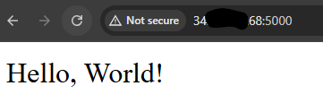
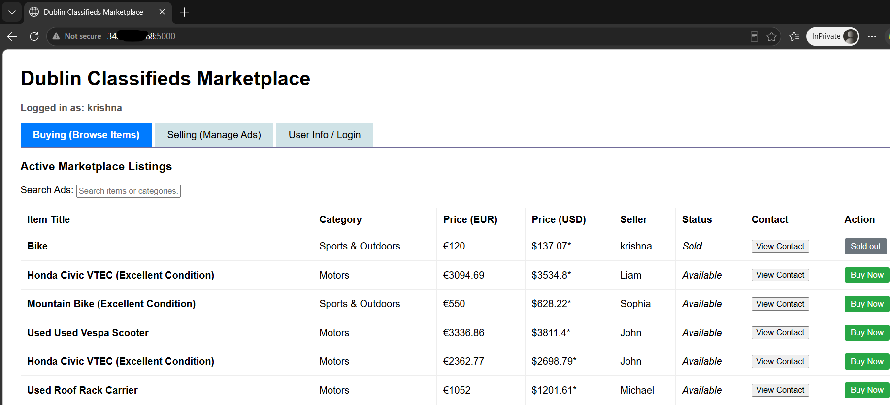

# 20100882-project
 PROGRAMMING FOR INFORMATION SYSTEMS Semester Repository

This Project is all about a local Dublin Classified Market place application. This allow users to browse listing , post ads and manage the items listed.


# Dublin Classifieds Marketplace

A localized, peer-to-peer peer classifieds exchange engine engineered using a modern lightweight Python stack. This full-stack system allows users to securely register accounts, sign in securely, post structured listings, edit asset data entries, and purchase goods using an asynchronous single-page checkout configuration.

---

## 🛠️ System Architecture

The core infrastructure operates on a decentralized Single-Page-Application model powered by a relational backend data layer:

* **Frontend Client:** Vanilla HTML5, CSS3 Grid layouts, and JavaScript Engine using local state caches.
* **Backend REST Layer:** Python Flask RESTful routing API with session tracking.
* **Relational Storage Engine:** SQLite3 relational schema utilizing strict foreign key constraints (`ON DELETE SET NULL`).
* **Exchange integration:** Connects securely to `open.er-api.com` to deliver automatic real-time currency conversions from EUR base values into target USD amounts.

---

## 📂 Project File & Folder Structure

```text

20100882-project-development/
│
├── app.py                  # Core Flask backend server (Routes, API endpoints, SQLite hooks)
├── seed_data.py            # Automation engine to script and inject mock data profiles
├── test_app.py            # Automated test suite (Unittest assertions for endpoints)
├── requirements.txt        # Managed Python library dependencies manifests
├── .gitignore              # Tracking exclusions filter (ignores venv/ and database files)
├── README.md               # Infrastructure documentation and deployment reference manual
│
├── templates/              # Presentation layer directory
│   └── index.html          # Single Page Application (SPA) client UI interface
│
└── images/                 # Asset media gallery
    └── sample-helloworld.png   # System verification capture screenshot
```
---

##  CRUD Operations

project supports full CRUD (Create, Read, Update, Delete) operations on the marketplace listings, secured by user authentication sessions.

* **CREATE (Post an Advertisement):** When a logged-in user wants to sell an item, the frontend passes a payload consisting of title, category, and price_eur. The backend intercepts this, grabs the user's information from the session (session['user_id']), and inserts a new row into the SQLite database with a default status of 'Available'.
    **Endpoint:** POST /api/listings

* **READ (Browse Listings):** This loops over the listings table. It pulls rows from the database and returns them to the user. It also dynamically contacts an external currency exchange provider matrix (open.er-api.com) to calculate and display the conversion pricing from Euros into US Dollars (USD) on the fly.
    **Endpoint:** GET /api/listings/<int:item_id>

* **UPDATE (Modify Ad Details / "Buy Now" Action):** If the logged-in session matches the item's original seller_id, the user is allowed to alter the title, category, or pricing parameters.
    **Endpoint:** PUT /api/listings/<int:item_id>

* **DELETE (Remove an Advertisement):** This deletes the entry from the marketplace entirely. To prevent malicious activity or unauthorized deletions, the route contains a strict gatekeeping conditional check: it matches the seller_id tied to the row inside the database against the user_id inside the current browser cookie session. If they do not match, it returns an HTTP 403 Unauthorized error code.
    **Endpoint:** DELETE /api/listings/<int:item_id>

    ### Features
            Browse / search listings, with live EUR -> USD price conversion
            Register / log in / log out (session based auth)
            Post, edit, delete logged in user ads
            "Buy Now" flow that marks a listing as Sold
            Ownership checks: only the seller who posted an ad can edit or delete it

## 🚀 Ubuntu Server Deploy Guide (GCP)

        GCP server configurations:

            Instance name: instance-2010xxxx-app
            instance type: 2 vCPU + 4 GB memory
            OS : Ubuntu 24.04 LTS Minimal
            Ports: allow HTTPS, HTTP, Custom port as needed by application
            External IP address
            custom ssh key to login to server

## 🛠️ Configuration to Run application in ubuntu server

        referance: https://medium.com/@mynameischandangupta1/how-to-install-flask-on-ubuntu-84bce8419dc0

                sudo apt update && apt upgrade -y
                sudo apt-get install python3-pip
                apt install python3.12-venv
                #enter in to project folder and execute below commands
                python3 -m venv venv
                source venv/bin/activate
                pip3 install Flask
                sudo apt install vim
                vi app.py  and then updaet sample code from the above url
                python3 app.py

                Open a web browser and go to http://ubuntu-externalIP:5000. You should see “Hello, World!” displayed.

<div align="center">
    
</div>

<div align="center">
    
</div>